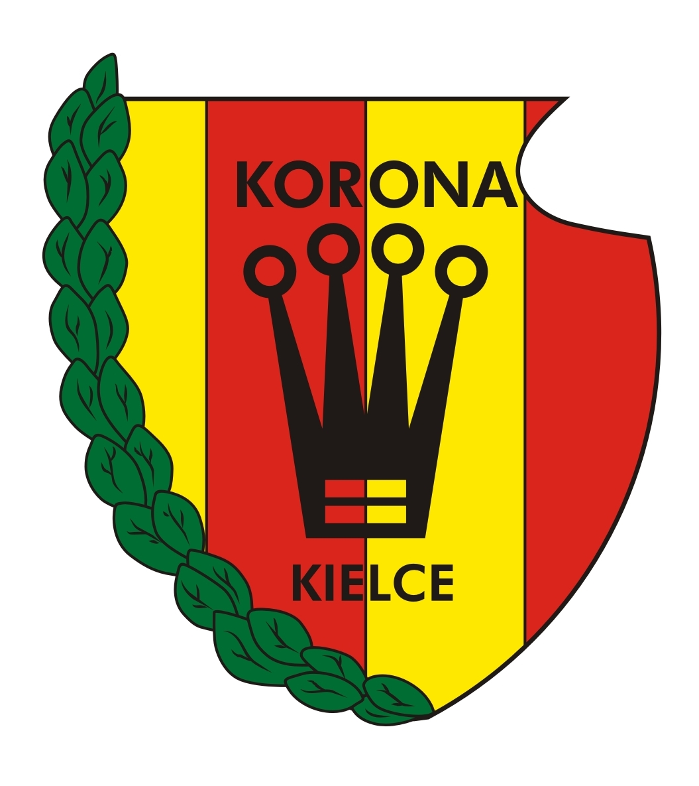

# Korona Kielce - informacje.
  * 🎙️ Konferencja prasowa po meczu Korona Kielce - Puszcza Niepołomice [NA ŻYWO] 🔴, [Cały artykuł](https://www.korona-kielce.pl/).
  * OFICJALNIE: Łukasz Maciejczyk właścicielem Korony Kielce! Rozpoczynamy nowy rozdział w Koronie S.A. 7 marca 2025 roku zapiszę się na kartach historii... 07.03.2025, [Cały artykuł](https://www.korona-kielce.pl/aktualnosci).
  * Decyzja o sprzedaży Korony Kielce zapadła po licznych rozmowach z zainteresowanymi stronami. Jeszcze na początku lutego chęć zakupu klubu wyraził Mariusz Siewierski, właściciel spółki Korona Management, były menedżer Roberta Lewandowskiego. Nie ujawnił jednak swoich wspólników, co wzbudziło wątpliwości radnych i kibiców., [Cały artykuł](https://sport.fakt.pl/pilka-nozna/korona-kielce-ma-nowego-wlasciciela-decyzja-radnych-szansa-jakiej-nie-mielismy/29yng1e).

# Korona Kielce - herb
  

# Korona Kielce - stadion
  