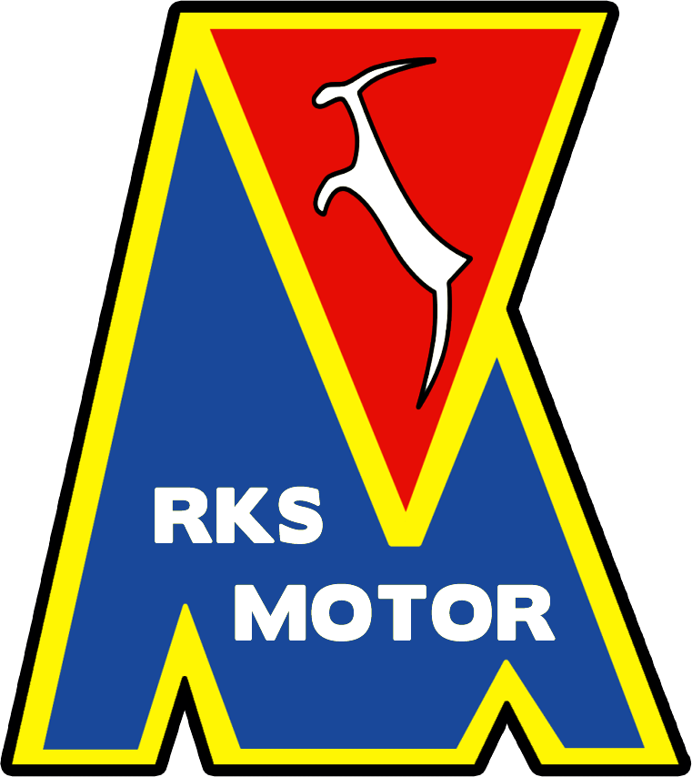
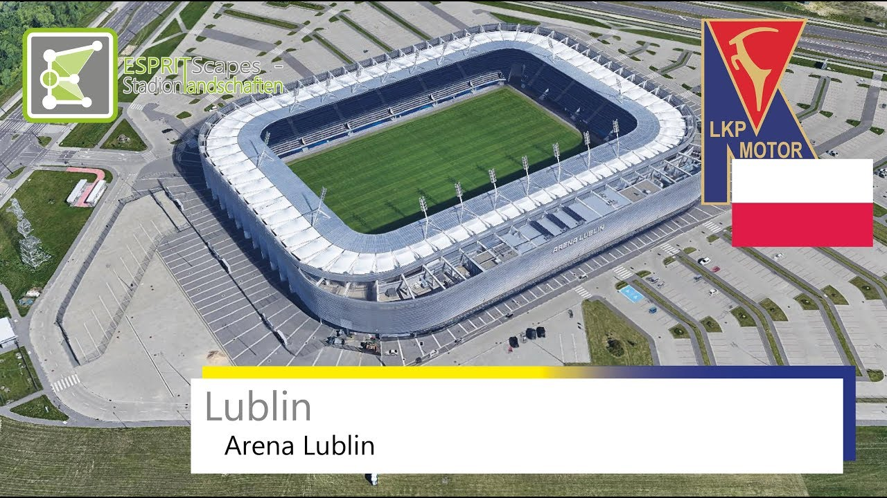

# Motor Lublin - informacje.
  * Trener Motoru Lublin stanie oko w oko z Goncalo Feio. Przemówił przed meczem. W 24. kolejce piłkarskiej Ekstraklasy Motor podejmie w poniedziałek Legię Goncalo Feio. "Po dwóch wygranych spotkaniach chcemy pokonać zespół z Warszawy, zdobyć kolejne trzy punkty i praktycznie rozstrzygnąć utrzymanie się w Ekstraklasie" — powiedział ..., [Cały artykuł](https://przegladsportowy.onet.pl/pilka-nozna/ekstraklasa/trener-motoru-lublin-stanie-oko-w-oko-z-goncalo-feio-przemowil-przed-meczem/zscfchx).
  * Znajdź najnowsze informacje o Motorze Lublin, klubie piłkarskim grającym w I lidze. Przeczytaj o nowym sponsorze, planach na rundę wiosenną, wynikach meczów i zapowiedziach., [Cały artykuł](https://motorlublin.eu/aktualnosci).
  * Stolarski nie ma wątpliwości, celem Motoru jest wygrana z Legią. Mateusz Stolarski, czyli trener Motoru Lublin na konferencji prasowej przed meczem z Legią Warszawa podkreślał, że napięty terminarz rywali wcale nie sprawia, że jego zespół ma przewagę nad rywalem. Zaznaczył jednak, że liczy na lepszy wynik niż w rundzie jesiennej, gdzie beniaminek Ekstraklasy przegrał w ..., [Cały artykuł](https://www.goal.pl/artykuly/motor-na-fali-dwoch-zwyciestw-do-lublina-przyjezdza-legia/).

# Motor Lublin - herb
  

# Motor Lublin - stadion
  