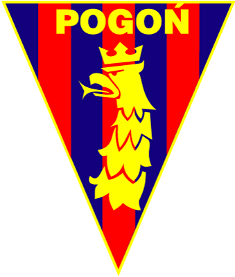
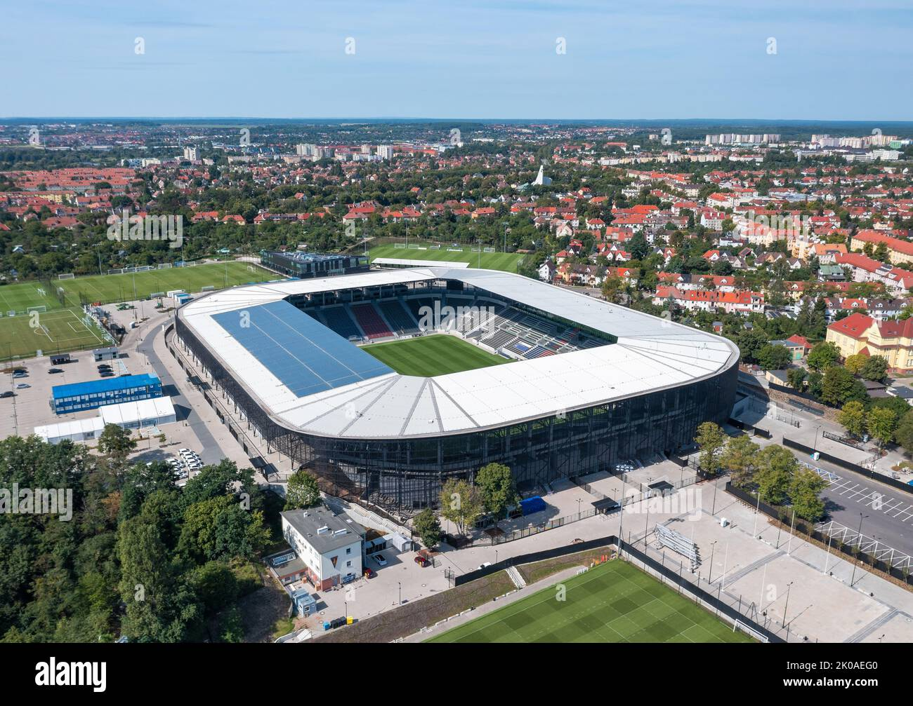

# Pogoń Szczecin - informacje.
  * Pogoń Szczecin - polski klub piłkarski z siedzibą w Szczecinie występujący w Ekstraklasie, dwukrotny wicemistrz Polski, czterokrotny finalista Pucharu Polski. Klub zajmuje 7. miejsce w tabeli wszech czasów ekstraklasy., [Cały artykuł](https://pl.wikipedia.org/wiki/Pogoń_Szczecin).
  * Dwie czołowe akademie piłkarskie na Pomorzu Zachodnim łączą siły! Przedstawiciele Pogoni Szczecin i Bałtyku Koszalin podpisali umowę partnerską, która pozwoli na jeszcze intensywniejszą wymianę wiedzy i zawodników pomiędzy obu klubami., [Cały artykuł](https://pogonszczecin.pl/akademia-aktualnosci).
  * Pogoń Szczecin podejmuje Lecha Poznań. Start o godz. 17.30. - Kibice pokazali już, że są z tym zespołem, ale... 28 lutego 2025, 19:08 pogoń szczecin lech poznań pogoń lech ..., [Cały artykuł](https://gs24.pl/pogon-szczecin-zagra-o-polfinal-pucharu-polski-z-piastem-gliwice-portowcy-chca-wrocic-do-stolicy/ar/c2-19077552).

# Pogoń Szczecin - herb
  

# Pogoń Szczecin - stadion
  