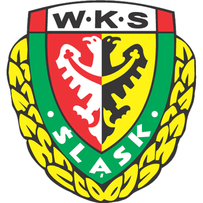
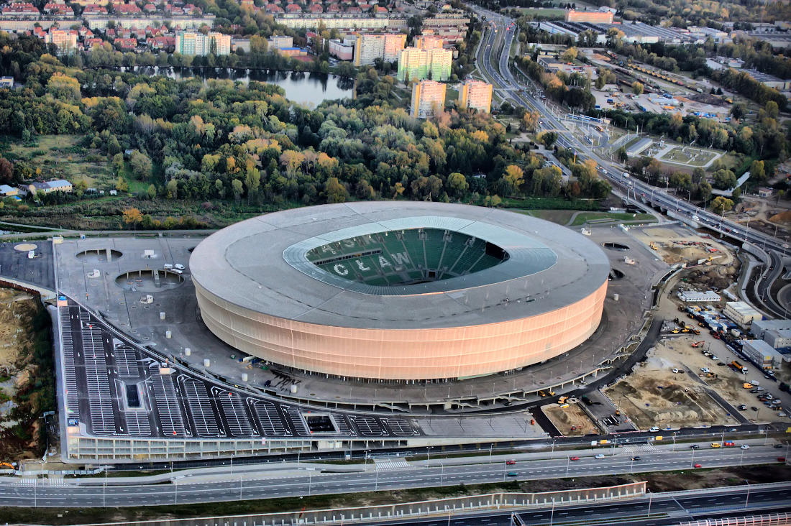

# Śląsk Wrocław - informacje.
  * Śląsk Wrocław zremisował z Pogonią Szczecin 1:1 na oczach blisko 13 tys. kibiców na Tarczyński Arena Wrocław., [Cały artykuł](https://gazetawroclawska.pl/blisko-13-tys-widzow-na-meczu-slask-wroclaw-pogon-szczecin-znajdz-siebie-na-trybunach/ar/c2p2-27344063).
  * Śląsk Wrocław przegrał z Legią w Warszawie 1:3 w meczu 23. kolejki PKO Ekstraklasy. Gole przy Łazienkowskiej zdobywali Marc Gual, Ruben Vinagre i Wojciech... PIŁKA NOŻNA. Śląsk II Wrocław w..., [Cały artykuł](https://gazetawroclawska.pl/sport/pilka-nozna/slask-wroclaw).
  * Śląsk Wrocław nie poddaje się w walce o utrzymanie w PKO BP Ekstraklasie. W piątkowym meczu 24. kolejki zremisował u siebie 1:1 z marzącą o europejskich pucharach Pogonią Szczecin. Znów gola strzelił najskuteczniejszy w lidze Efthymis Koulouris., [Cały artykuł](https://eurosport.tvn24.pl/pilka-nozna/pko-bp-ekstraklasa/2024-2025/slask-wroclaw-pogon-szczecin-wynik-i-relacja-z-meczu-24.-kolejki-pko-bp-ekstraklasy_sto20133392/story.shtml).

# Śląsk Wrocław - herb
  

# Śląsk Wrocław - stadion
  